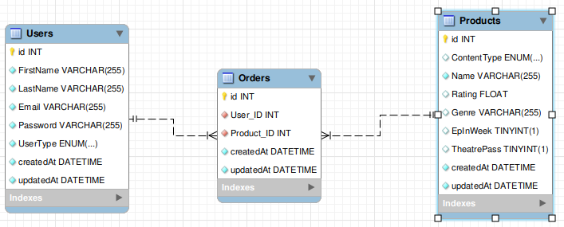

# movie-backend

Welcome to my first project focused on the back-end. It consists of a REST API and a database.

For this project, I had to re-create a database similar to one a company like "BlockBusters" [(Rest in peace...)](<https://en.wikipedia.org/wiki/Blockbuster_(retailer)#:~:text=Between%20November%206%2C%202013%2C%20and,mail%20program%20was%20shut%20down.>) would use, and also a system that would handle user registration, login, authentication and authorization! [JWT](https://jwt.io/) was essential for this.

And on top of that, many endpoints that would handle get requests, patch requests, delete requests, etc...

# Technologies used

The database is [MySQL](https://www.mysql.com/) and the ORM chosen to work with MySQL is [sequelize](https://sequelize.org/). ⚙️

I relied heavily on [ExpressJS](https://expressjs.com/) for handling everything related with the API. 🤖

# Database ER diagram

# Instructions

I have uploaded the DB to a [railway](https://railway.app/) instance, this instance will only linger around for 200 hours since this REPO's creation. (The railway instance will be down 2 weeks after this repo being deployed, so don't expect it to be there anymore if you're reading this.)

Setting up locally:

(Requires docker)

`git clone https://github.com/gmluqa/movie-backend.git`

`cd movie-backend`

`npm i`

Rename .env.example and config/config.json.example to .env and config/config.json respectively. All variables for local development are set! 👾

`npm run docker:up` Spins up a docker instance containing a MySql server

`npm run sqlMake` Deploys the database

`npm run listen` Deploys the API, linked to the database

And that is all for set-up, time to run some endpoints. 👉

# Endpoints avaliable

Every single possible endpoint can be found in the `./tests` folder. 🧪, there is one well formed test example, alongside one that is meant to achive an error response from the API.

# Credits

\* Interesting tidbits I learned during this project:

- HTTP 204 codes do not send json responses! Even if you try send them alongside the status code, read more about the subject [here](https://bambielli.com/til/2017-03-26-express-res-204/).

- [MD5 encryption is NOT secure!](https://youtu.be/GI790E1JMgw?t=881)

I'd like to thank my tutors at [GeeksHubs Academy](https://geekshubs.com/) for their excellent guidance on carrying out this weekly programming challenge.

I will update this repo in the future with more middleware to control user registration inputs and time-based JWT tokens, as well as minimizing information input in URI's, stay tuned!
